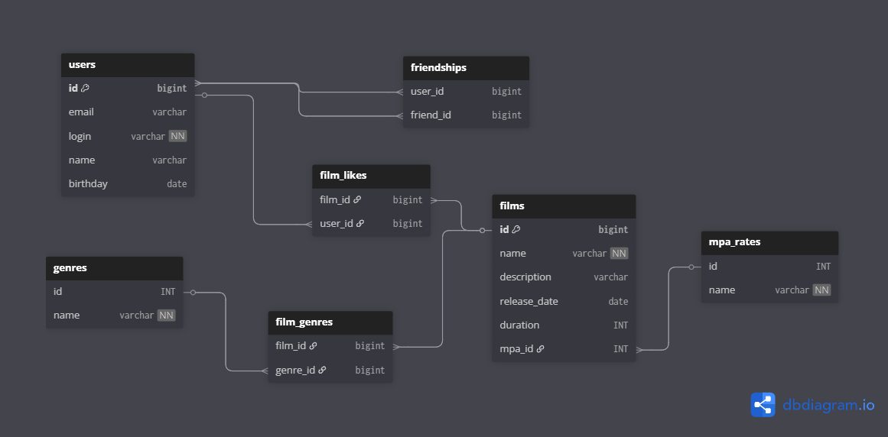

# java-filmorate

---

## ER-схема проекта:



# Примеры SQL-запросов:

Выборка 10 первых пользователей у которых домен почты: gmail:
```
SELECT id, email, login
FROM users
WHERE email LIKE '@gmail.com'
ORDER BY id
LIMIT 10;
```

Выборка всех пользователей, которые поставили лайк определенному фильму в алфавитном порядке логина:
```
SELECT 
  u.login 
FROM 
  users u 
WHERE 
  u.id IN (
    SELECT 
      fl.user_id 
    FROM 
      film_likes fl 
    JOIN 
      films f ON fl.film_id = f.id 
    WHERE 
      f.name = 'Название фильма'
  ) 
ORDER BY 
  u.login ASC;
```
